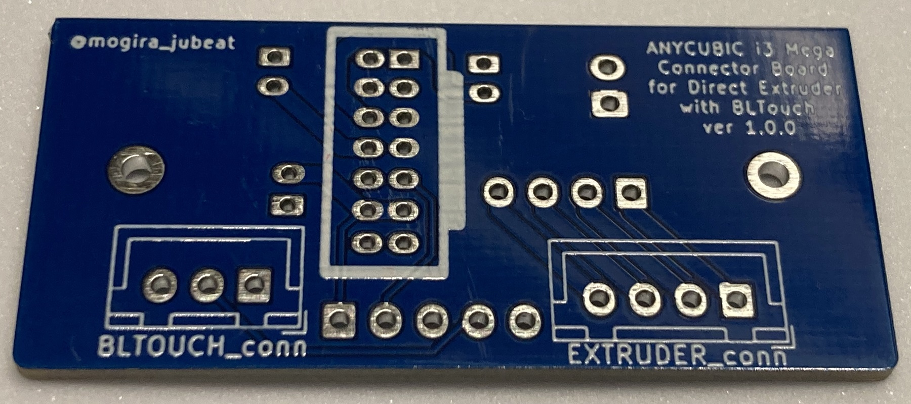
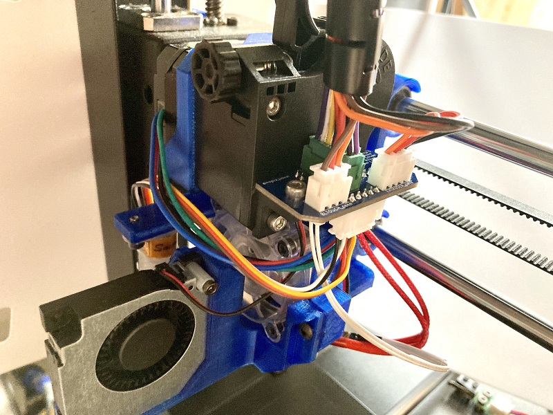

> # :warning:CAUTION: DO NOT USE THIS VERSION!!
> v1.0.0 board needs to expand the screw holes of it. But that causes short-circuiting.

 

# Anycubic i3 Mega S Connector Board
## Overview
This is the project to create the connector board for ["MONOBLOCK" ANYUCBIC I3 MEGA-S Direct Extruder MOD add BLTouch by Toshi_Yamamoto](https://www.thingiverse.com/thing:4035830).  
The board accepts BLTouch, Extruder Motor and the extension cords to these from motherboard additinally.

### Remarks
**If you need switch, capacitors and resistors of the stock board, you can not use this board because I removed them.**

 

## [>> Build Guide](docs/build_guide.md)

 

## [>> CADLAB.io](https://cadlab.io/node/23246/)

 

## [>> Circuit Board Gallery](docs/circuit_board_gallery.md)

 

## Gallery

