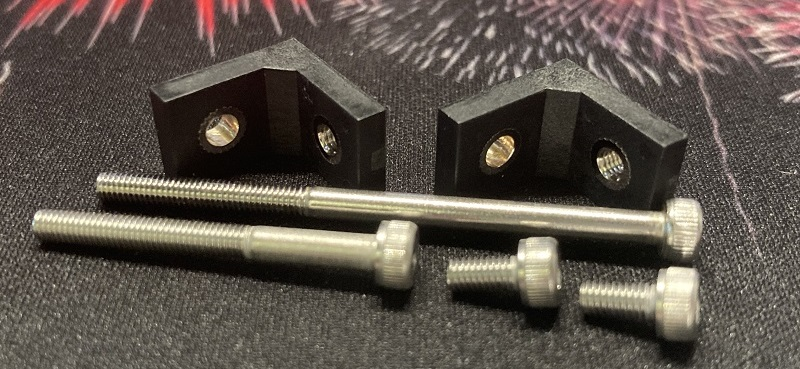
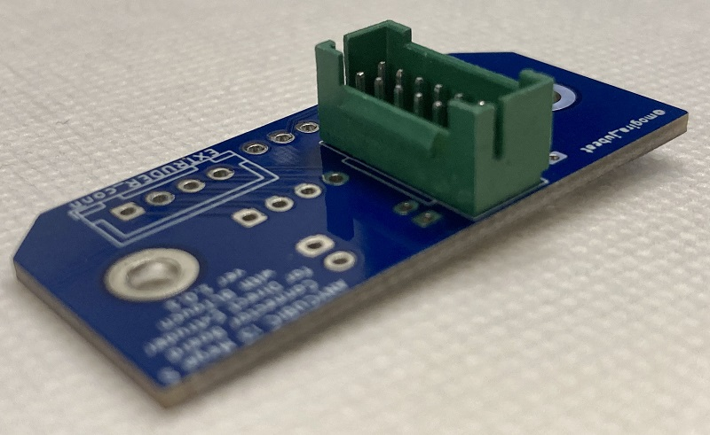

# Build Guide
## Parts List
| Name | Quantity | Remark |
|------|:--------:|--------|
| MAC8 AXA-15-M3-3.2 | 2 | (can use but not recommend) or AXA-15-M3 |
| (2x7 2mm Pitch) Green Connector | 1 | transplant from the stock board |
| JST **PH** Female Connector 1x2 | 3 | |
| JST XH Female Connector 1x2 | 1 | |
| JST XH Female Connector 1x2 | 1 | |
| JST XH Female Connector 1x3 | 1 | |
| JST XH Female Connector 1x4 | 2 | |
| JST XH Female Connector 1x5 | 1 | |
| JST XH Male Connector 1x3 | 1 | |
| JST XH Male Connector 1x4 | 2 | |
| JST XH Male Connector 1x5 | 1 | |
| JST XH Connector Contact | 16 | |
| Dupont/QI/2550 Connector 1x1 | 3 | |
| Dupont/QI/2550 Connector Contact| 3 | |
| M3 Screw 50mm | 1 | |
| M3 Screw 30mm | 1 | |
| M3 Screw 6mm | 2 | |

And you need a crimp tool. I recommend "ENGINEER PA-09" to crimp XH and PH connectors.

 

## Notes
* Silks are changed from the stock board as below:
    * T0 -> Thermistor
    * FAN0 -> PartsFan
    * FAN2 -> HotEndFan

 

## Procedures
### 1. Remove the parts from the stock board
You must remove the Green Connector to transplant to the new board.  
About the other connectors, do as you like.  

 

### 2. Expand the holes with drill
#### **AXA-15-M3 (recommend)**
If you substitute AXA-15-M3 for AXA-15-M3-3.2, it is better to expand the screw hole on the extruder side of it to 3.2mm (M3 Clearance hole size).  

 

### 3. Solder the parts to the board
It is easier to implement the GreenConnector firstly.  

 

### 4. Crimp the connectors
You should crimp the following connectors:
* BLTOUCH_conn (1x3 XH)  
  
* EXTRUDER_conn (1x4 XH)  
    
  \* You should extend the Extruder connector cable to the print head.
* BLTouch (1x5 XH)  
  
* Extruder (1x4 XH)  
  

 

### 5. Assemble

